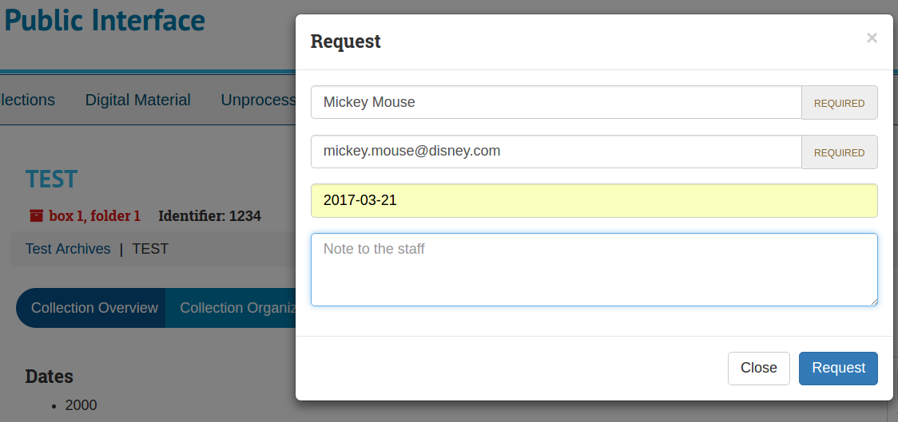
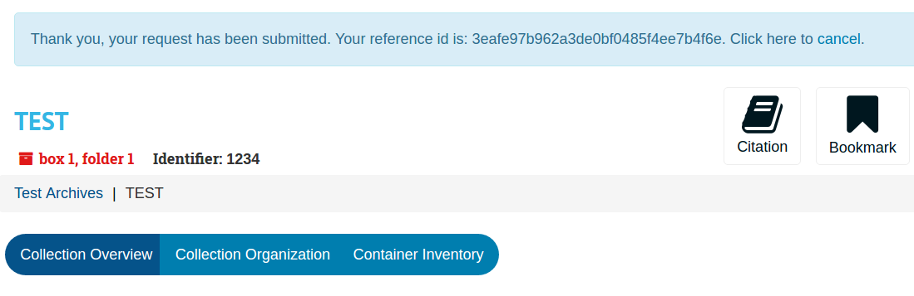
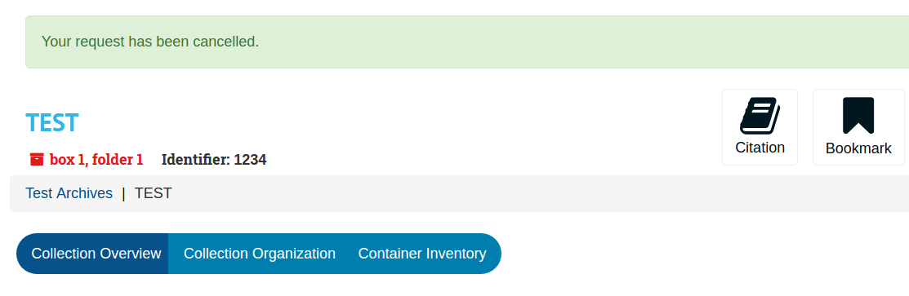
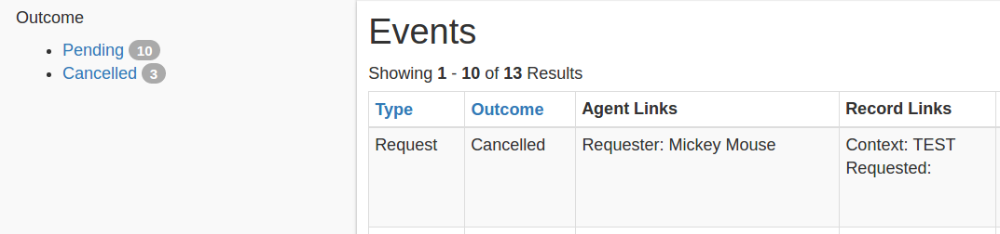
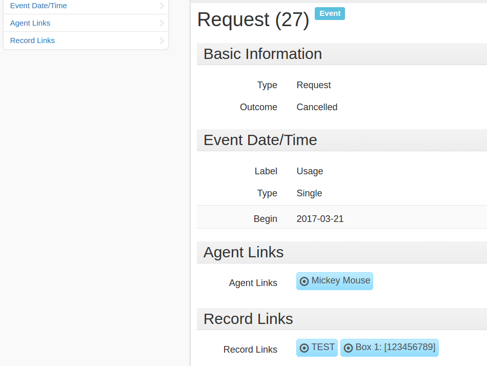
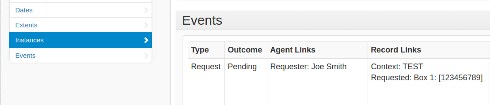
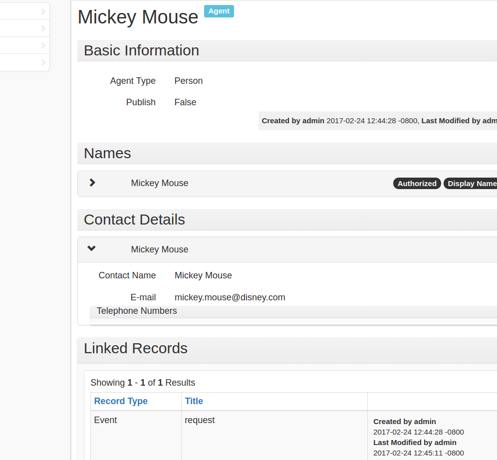

# aspace-requests

Adds a "request" type to Events and implements public interface requests
functionality.

## Summary

- Handle requests for materials as event records within ArchivesSpace.
- Upon creating a request the requester is given a reference id.
- The requester is given a chance to cancel the request (via link).
- An agent record is created for the requester with email for correspondence.
- Requests can be searched for, viewed and processed by staff.
- A requests report is available to see requests within a date range (TODO).
- No emails =)

## TODO

- Add lookup request in public ui by reference id?
- Add form to cancel request (as part of lookup)?
- Actually add that report ...
- Create system request user (so config handled transparently)
- Privacy option (scheduled anonymization or purge of request events not "pending")

## EXAMPLES

Create a request:



Request created:



Can be cancelled:



Browsing events:



Event request record showing links:



Instance view of events:



Agent view of events:



## Backend endpoints

```
curl -H "X-ArchivesSpace-Session: $TOKEN" \
  -H "Content-Type: application/json" \
  -X POST \
  -d @request.json \
  http://localhost:4567/plugins/aspace_requests/repositories/2/requests

# DELETE is really an update as it sets the event to "cancelled"
# this is like "deleting" the request, but not the event. This ok?
curl -H "X-ArchivesSpace-Session: $TOKEN" \
  -X DELETE \
  http://localhost:4567/plugins/aspace_requests/repositories/2/requests/5?refid=123
```

## Compatibility

- v2.3.0

---
